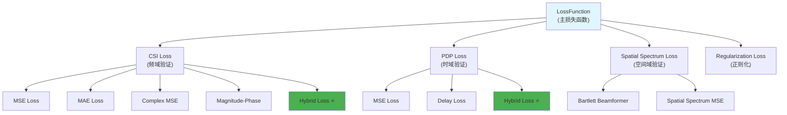

# Prism 损失函数系统

## 概述

Prism项目实现了一个多层次的损失函数系统，用于训练神经网络进行电磁射线追踪和CSI预测。该系统结合了频域、时域和空间域的验证方法，确保模型在多个维度上的准确性。

## 损失函数架构



## 1. CSI损失函数 (CSILoss)

### 1.1 概述
CSI损失函数专门用于比较复数值的信道状态信息矩阵，提供5种不同的计算方法。

### 1.2 损失类型

#### **MSE损失** (`'mse'`)
标准的复数均方误差损失：
```python
diff = predicted_csi - target_csi
loss = torch.mean(torch.abs(diff)**2)
```

#### **MAE损失** (`'mae'`)
复数平均绝对误差损失：
```python
diff = predicted_csi - target_csi
loss = torch.mean(torch.abs(diff))
```

#### **复数MSE损失** (`'complex_mse'`)
分别计算实部和虚部的MSE：
```python
real_loss = F.mse_loss(predicted_csi.real, target_csi.real)
imag_loss = F.mse_loss(predicted_csi.imag, target_csi.imag)
loss = real_loss + imag_loss
```

#### **幅度-相位损失** (`'magnitude_phase'`)
分别计算幅度和相位的损失：
```python
# 幅度损失
magnitude_loss = F.mse_loss(torch.abs(predicted_csi), torch.abs(target_csi))

# 相位损失 (循环相位差)
pred_phase = torch.angle(predicted_csi + 1e-8)
target_phase = torch.angle(target_csi + 1e-8)
phase_diff = torch.remainder(pred_phase - target_phase + π, 2π) - π
phase_loss = torch.mean(phase_diff**2)

loss = magnitude_weight * magnitude_loss + phase_weight * phase_loss
```

#### **混合损失** (`'hybrid'`) ⭐ **推荐**
组合复数MSE、幅度和相位损失：
```python
loss = cmse_weight * cmse_loss + 
       magnitude_weight * magnitude_loss + 
       phase_weight * phase_loss
```

### 1.3 相位计算说明

**重要**: 所有相位计算使用**弧度制**：
- `torch.angle()` 返回范围：`[-π, π]` 弧度
- 循环相位差处理：`torch.remainder(phase_diff + π, 2π) - π`
- 数值稳定性：添加小量 `1e-8` 避免零值

### 1.4 配置示例
```yaml
csi_loss:
  type: 'hybrid'
  phase_weight: 1.0
  magnitude_weight: 1.0
  cmse_weight: 1.0
```

## 2. PDP损失函数 (PDPLoss)

### 2.1 概述
功率延迟分布(PDP)损失函数通过IFFT将CSI转换为时域进行验证，提供时域特性的约束。

### 2.2 损失类型

#### **MSE损失** (`'mse'`)
直接比较PDP的均方误差：
```python
pdp_pred = self._compute_pdp(predicted_csi)
pdp_target = self._compute_pdp(target_csi)
loss = F.mse_loss(pdp_pred, pdp_target)
```

#### **延迟损失** (`'delay'`)
使用软argmax计算主径延迟差异：
```python
# 软argmax计算延迟
pred_weights = torch.softmax(pdp_pred * 10, dim=-1)
target_weights = torch.softmax(pdp_target * 10, dim=-1)
pred_delay = torch.sum(indices * pred_weights, dim=-1)
target_delay = torch.sum(indices * target_weights, dim=-1)

# 归一化延迟差
delay_diff = torch.abs(pred_delay - target_delay) / fft_size
loss = torch.mean(delay_diff)
```

#### **混合损失** (`'hybrid'`) ⭐ **推荐**
组合MSE和延迟损失：
```python
loss = 0.7 * mse_loss + 0.3 * delay_loss
```

### 2.3 PDP计算
```python
def _compute_pdp(self, csi_data):
    # 零填充到FFT大小
    padded_csi = torch.zeros(batch_size, fft_size, dtype=complex)
    padded_csi[:, :N] = csi_data
    
    # IFFT计算时域响应
    time_domain = torch.fft.ifft(padded_csi, dim=-1)
    
    # 功率延迟分布
    pdp = torch.abs(time_domain) ** 2
    return pdp
```

### 2.4 配置示例
```yaml
pdp_loss:
  type: 'hybrid'
  fft_size: 1024
  normalize_pdp: true
```

## 3. 空间频谱损失函数 (SpatialSpectrumLoss)

### 3.1 概述
空间频谱损失函数通过CSI生成空间频谱进行比较，用于波束形成和到达方向(DOA)应用的验证。

### 3.2 核心算法

#### **Bartlett波束形成器**
```python
def _compute_spatial_spectrum(self, csi, subcarrier_idx):
    # 生成导向矢量
    steering_vectors = self._generate_steering_vectors(theta_flat, phi_flat, frequency)
    
    # 协方差矩阵
    R_xx = torch.matmul(csi_normalized, torch.conj(csi_normalized).transpose(-2, -1))
    
    # Bartlett功率谱
    R_A = torch.matmul(R_xx, steering_vectors)
    powers = torch.real(torch.sum(torch.conj(steering_vectors) * R_A, dim=0))
    
    return powers.reshape(theta_points, phi_points)
```

#### **损失函数类型**

空间频谱损失支持两种损失函数：

##### **MSE损失** (`'mse'`) - 默认
```python
loss = F.mse_loss(predicted_spectrum_normalized, target_spectrum_normalized)
```
- **优势**: 计算简单，收敛稳定
- **劣势**: 不考虑空间结构信息

##### **SSIM损失** (`'ssim'`) - 推荐 ⭐
```python
def _compute_ssim_loss(self, predicted_spectrum, target_spectrum):
    # 转换为4D张量 (B, C, H, W)
    pred_4d = predicted_spectrum.unsqueeze(1)
    target_4d = target_spectrum.unsqueeze(1)
    
    # 计算SSIM
    ssim_value = self._ssim_pytorch(pred_4d, target_4d)
    
    # 转换为损失 (1 - SSIM)
    return 1.0 - ssim_value
```
- **优势**: 考虑结构相似性，更符合感知质量
- **劣势**: 计算复杂度较高

#### **导向矢量计算**
```python
def _generate_steering_vectors(self, theta, phi, frequency):
    # 方向向量
    directions = torch.stack([
        torch.sin(theta) * torch.cos(phi),  # x
        torch.sin(theta) * torch.sin(phi),  # y  
        torch.cos(theta)                    # z
    ], dim=1)
    
    # 相位偏移 (使用弧度)
    k = 2 * π / wavelength
    phase_shifts = k * torch.matmul(antenna_positions, directions.T)
    
    # 复数导向矢量
    steering_vectors = torch.exp(-1j * phase_shifts)
    return steering_vectors
```

### 3.3 角度处理

**输入**: 配置文件中使用度数 (degrees)
```yaml
spatial_spectrum_loss:
  theta_range: [0, 5, 90]    # [min, step, max] in degrees
  phi_range: [0, 10, 360]    # [min, step, max] in degrees
```

**内部处理**: 自动转换为弧度 (radians)
```python
theta_min_rad = np.deg2rad(theta_min)
phi_min_rad = np.deg2rad(phi_min)
```

**可视化**: 转换回度数显示
```python
theta_deg = np.rad2deg(self.theta_grid.cpu().numpy())
phi_deg = np.rad2deg(self.phi_grid.cpu().numpy())
```

### 3.4 多子载波融合

#### **平均融合** (`'average'`)
```python
fused_spectrum = spectrum_accumulator / valid_count
```

#### **最大值融合** (`'max'`)
```python
fused_spectrum = torch.maximum(spectrum_accumulator, spectrum_k)
```

### 3.5 配置示例

#### **MSE损失配置** (默认)
```yaml
spatial_spectrum_loss:
  enabled: true
  algorithm: 'bartlett'
  fusion_method: 'average'
  loss_type: 'mse'            # 使用MSE损失
  theta_range: [0, 5, 90]     # degrees
  phi_range: [0, 10, 360]     # degrees
```

#### **SSIM损失配置** (推荐)
```yaml
spatial_spectrum_loss:
  enabled: true
  algorithm: 'bartlett'
  fusion_method: 'average'
  loss_type: 'ssim'           # 使用SSIM损失
  theta_range: [0, 5, 90]     # degrees
  phi_range: [0, 10, 360]     # degrees
  
  # SSIM参数
  ssim_window_size: 11        # 滑动窗口大小 (奇数)
  ssim_k1: 0.01              # SSIM常数K1
  ssim_k2: 0.03              # SSIM常数K2
```

#### **SSIM参数调优指南**
- **ssim_window_size**: 
  - 小窗口 (7): 更敏感，适合高分辨率频谱
  - 中等窗口 (11): 平衡选择，推荐默认值
  - 大窗口 (15): 更稳定，适合低分辨率频谱
- **ssim_k1, ssim_k2**: 通常使用默认值 (0.01, 0.03)

## 4. 主损失函数 (LossFunction)

### 4.1 多目标训练
主损失函数组合所有子损失：
```python
total_loss = (csi_weight * csi_loss + 
              pdp_weight * pdp_loss + 
              spatial_spectrum_weight * spatial_loss + 
              regularization_weight * reg_loss)
```

### 4.2 默认权重配置
```python
DEFAULT_LOSS_CONFIG = {
    'csi_weight': 0.7,                    # CSI损失权重
    'pdp_weight': 0.3,                    # PDP损失权重  
    'spatial_spectrum_weight': 0.0,       # 空间频谱损失权重 (默认关闭)
    'regularization_weight': 0.01,        # 正则化权重
}
```

### 4.3 完整配置示例
```yaml
training:
  loss:
    csi_weight: 0.7
    pdp_weight: 0.3
    spatial_spectrum_weight: 0.1
    regularization_weight: 0.01
    
    csi_loss:
      type: 'hybrid'
      phase_weight: 1.0
      magnitude_weight: 1.0
      cmse_weight: 1.0
      
    pdp_loss:
      type: 'hybrid'
      fft_size: 1024
      normalize_pdp: true
      
    spatial_spectrum_loss:
      enabled: true
      algorithm: 'bartlett'
      fusion_method: 'average'
      theta_range: [0, 5, 90]
      phi_range: [0, 10, 360]
```

## 5. 重要更新说明

### 5.1 已移除功能
**相关性损失已被移除**，原因是实现不正确：
- ❌ `correlation` 损失类型不再支持
- ❌ `correlation_weight` 参数已移除
- ✅ 混合损失已重新平衡权重

### 5.2 数值稳定性改进
- 相位计算添加小量 `1e-8` 避免零值
- PDP归一化使用峰值归一化
- 空间频谱使用最大值归一化
- 复数MSE手动计算避免CUDA兼容性问题

### 5.3 性能优化
- 向量化空间频谱计算
- 预计算角度组合
- 批处理支持
- GPU加速

## 6. 使用示例

### 6.1 基本使用
```python
from prism.loss import LossFunction

# 创建损失函数
loss_config = {
    'csi_weight': 0.7,
    'pdp_weight': 0.3,
    'csi_loss': {'type': 'hybrid'},
    'pdp_loss': {'type': 'hybrid'}
}
loss_fn = LossFunction(loss_config)

# 计算损失
predictions = {'csi': pred_csi, 'traced_csi': traced_pred}
targets = {'csi': target_csi, 'traced_csi': traced_target}
total_loss, components = loss_fn(predictions, targets)

print(f"Total Loss: {total_loss.item():.6f}")
print(f"CSI Loss: {components['csi_loss']:.6f}")
print(f"PDP Loss: {components['pdp_loss']:.6f}")
```

### 6.2 空间频谱损失可视化
```python
# 计算并可视化空间频谱损失
loss_value, plot_path = loss_fn.compute_and_visualize_spatial_spectrum_loss(
    predicted_csi=pred_csi,
    target_csi=target_csi,
    save_path="./results/spatial_spectrum/",
    sample_idx=0
)
print(f"Spatial Spectrum Loss: {loss_value:.6f}")
print(f"Visualization saved to: {plot_path}")
```

## 7. 故障排除

### 7.1 常见问题

**Q: 相位损失数值异常**
A: 检查输入CSI是否包含零值，相位计算会添加 `1e-8` 避免数值问题

**Q: 空间频谱损失为零**
A: 检查 `spatial_spectrum_weight > 0` 且 `enabled: true`

**Q: PDP损失计算失败**
A: 确保 `fft_size` 设置合理，通常为1024或2048

### 7.2 性能优化建议
- 使用混合损失获得最佳效果
- 根据应用场景调整损失权重
- 空间频谱损失计算量大，可适当降低角度分辨率
- 使用GPU加速大批量计算

---

*文档版本: v1.0*  
*最后更新: 2025年1月*  
*维护者: Prism项目团队*
