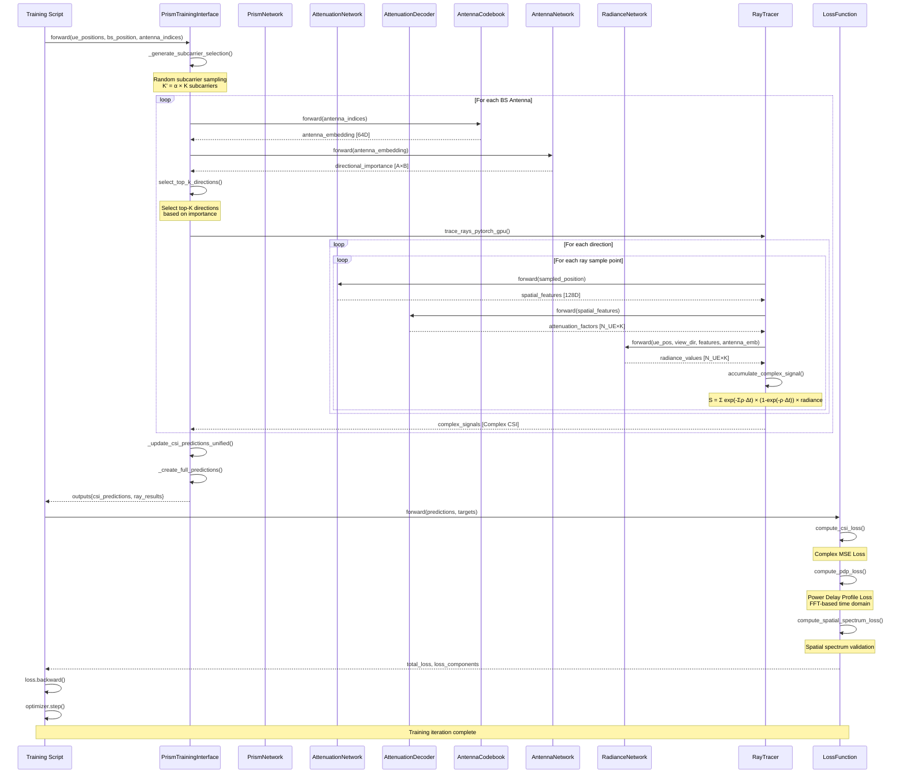

# Prism Network Architecture Design

## Overview

This document describes the redesigned Prism network architecture that addresses the computational efficiency issues of the previous design while maintaining the virtual link concept for OFDM communication systems.

## Key Design Principles

This project extends $\text{NeRF}^2$ to a $K$-subcarrier wideband OFDM communication system. We consider a single base station equipped with an $N_{\text{BS}}$-element antenna array, and a user equipment (UE) equipped with an $N_{\text{UE}}$-element antenna array. The goal is to estimate the $K$-dimensional CSI values received at each base station antenna.

Specifically, we enhance the AttenuationNetwork by introducing an $N_{\text{UE}}$-channel AttenuationDecoder. The AttenuationNetwork takes as input the position of a sampled point $P_\text{v}$ and produces a 128-dimensional feature vector $F$. Each channel of the AttenuationDecoder processes the attenuation feature $F$ and outputs $K$ complex-valued CSI values, representing the attenuation factors at the sampled points. As a result, the output of the decoder is a $N_{\text{UE}}\times K$ matrix of complex-valued outputs.

To model the radiation pattern of each base station antenna, we construct an $N_{\text{BS}}$-entry antenna codebook, where each entry is a 64-dimensional learnable embedding corresponding to one antenna. The RadianceNetwork accepts the antenna embedding $C_i$ of the $i^\text{th}$ antenna, the viewing direction $\omega$, and the UE position $P_{\text{UE}}$. These inputs are combined to produce a $N_{\text{UE}} \times K$ matrix of complex-valued outputs, capturing the radiation-dependent CSI observed at the UE.

**Note**: All spatial inputs (sampled point position $P_\text{v}$, viewing direction $\omega$, and UE position $P_{\text{UE}}$) are IPE-encoded before being processed by the networks.

## Network Architecture

### 1. AttenuationNetwork

**Purpose**: Encode spatial position information into a compact feature representation

**Input**: 
- Sampling point position (3D coordinates) - **IPE-encoded**

**Output**: 
- Single 128-dimensional feature vector (configurable dimension)

**Architecture**: 
- Similar to Standard NeRF density network architecture with 8 layers and shortcuts
- Input: IPE-encoded 3D → Hidden: 256D → Output: 128D
- **Note**: Outputs complex-valued features for RF signal modeling

**Key Benefits**:
- Single network instead of $K \times N_{\text{UE}}$ independent networks
- Compact 128D representation instead of $K \times N_{\text{UE}} \times 128D$
- Maintains spatial encoding capabilities
- Standard NeRF architecture ensures proven performance and stability

### 2. Attenuation Decoder

**Purpose**: Convert 128D features into $N_{\text{UE}} \times K$ attenuation factors

**Input**: 
- 128-dimensional feature vector from AttenuationNetwork

**Output**: 
- $N_{\text{UE}} \times K$ attenuation values for all UE antenna channels
- Total: $N_{\text{UE}} \times K$ attenuation values
- **Complex-valued outputs** for accurate RF signal modeling

**Architecture**: 
- Single network processing all UE antenna channels
- Network: 128D → 256D → 256D → $N_{\text{UE}} \times K$
- Output: Complex values representing attenuation factors

**Key Benefits**:
- Direct output of all $N_{\text{UE}} \times K$ channel values
- Efficient processing of all UE antenna channels simultaneously
- Maintains virtual link concept for OFDM communication
- **Complex-valued outputs** capture both magnitude and phase information

### 3. RadianceNetwork

**Purpose**: Process UE position, viewing direction, spatial features, and antenna-specific embeddings to output radiation characteristics

**Input**: 
- UE position (3D coordinates) - **IPE-encoded**
- Viewing direction (3D vector) - **IPE-encoded**
- 128-dimensional feature vector from AttenuationNetwork
- **Antenna embedding index** (to select from BS antenna codebook)

**Output**: 
- $N_{\text{UE}} \times K$ radiation values for all UE antenna channels
- Total: $N_{\text{UE}} \times K$ radiation values

**Architecture**: 
- Structure similar to the color subnetwork in standard NeRF
- Single network processing all UE antenna channels
- Each channel processes: [IPE-encoded UE_pos, IPE-encoded view_dir, 128D_features, 64D_antenna_embedding] → $N_{\text{UE}} \times K$ radiation values
- **Antenna Codebook**: Learnable 64-dimensional embeddings for each BS antenna
- Output: Complex values representing radiation characteristics

**Key Benefits**:
- Direct output of all $N_{\text{UE}} \times K$ channel radiation values
- Incorporates spatial features from AttenuationNetwork
- **Antenna-specific radiation patterns**: Each BS antenna has unique learnable embedding
- **Flexible antenna selection**: Can handle different antenna configurations
- Maintains virtual link concept for complete OFDM system modeling
- **Standard NeRF color subnetwork architecture** ensures proven performance and stability

### 4. Antenna Embedding Codebook

**Purpose**: Provide learnable antenna-specific embeddings to capture unique radiation patterns of each BS antenna

**Structure**:
- **Codebook Size**: $N_{\text{BS}}$ learnable embeddings ($N_{\text{BS}}$ = 64 for typical configurations)
- **Embedding Dimension**: 64-dimensional learnable vectors
- **Total Parameters**: $N_{\text{BS}}$ × 64 = 4,096 learnable parameters

**Implementation**:
- **Lookup Table**: Indexed by antenna ID (0 to $N_{\text{BS}}$-1)
- **Learnable Parameters**: Each embedding is a trainable 64D vector
- **Initialization**: Random initialization or pre-trained embeddings
- **Gradient Flow**: Full gradient updates during training

**Key Features**:
- **Antenna Diversity**: Each antenna learns unique radiation characteristics
- **Efficient Storage**: Compact 64D representation per antenna
- **Easy Extension**: Can add new antennas by extending the codebook
- **Transfer Learning**: Pre-trained embeddings can be fine-tuned for new scenarios

### 5. AntennaNetwork

**Purpose**: Process antenna embeddings to generate directional importance indicators for efficient directional sampling

**Input**: 
- 64-dimensional antenna embedding from the antenna codebook

**Output**: 
- $A \times B$ directional importance matrix (indicator matrix)
- Each element indicates the importance of a specific direction in the $A \times B$ directional grid

**Architecture**: 
- **Shallow Network**: Lightweight architecture for efficient processing
- **Input**: 64D antenna embedding → **Hidden**: 128D → **Output**: $A \times B$ importance values
- **Activation**: Softmax or sigmoid to normalize importance scores
- **Output Shape**: $A \times B$ matrix where $A$ and $B$ are configurable directional divisions

**Directional Space Division**:
- **Azimuth Division**: $A$ directions (e.g., 8, 16, or 32 azimuthal angles)
- **Elevation Division**: $B$ directions (e.g., 4, 8, or 16 elevation angles)
- **Total Directions**: $A \times B$ possible directional combinations
- **Centered at Antenna**: Directional space is centered at the antenna position

**Top-K Sampling**:
- **Importance Ranking**: Sort all $A \times B$ directions by importance score
- **Top-K Selection**: Select the $K$ most important directions for detailed processing
- **Sampling Efficiency**: Reduces computational complexity from $A \times B$ to $K$ directions
- **Configurable K**: $K$ can be adjusted based on accuracy vs. efficiency requirements

**Key Benefits**:
- **Directional Awareness**: Captures antenna-specific directional preferences
- **Efficient Sampling**: Reduces directional space from $A \times B$ to $K$ important directions
- **Lightweight Processing**: Shallow network minimizes computational overhead
- **Configurable Resolution**: $A$ and $B$ can be adjusted for different angular resolutions
- **Antenna-Specific**: Each antenna learns its own directional importance patterns
- **Integration Ready**: Seamlessly integrates with existing RadianceNetwork for focused processing

## Parameter Configuration

### Core Parameters

```yaml
model:
  num_subcarriers: K             # K: Number of subcarriers
  num_ue_antennas: N_UE         # N_{\text{UE}}: Number of UE antennas
  num_bs_antennas: N_BS         # N_{\text{BS}}: Number of BS antennas
  position_dim: 3               # 3D position coordinates
  hidden_dim: 256               # Hidden layer dimension
  feature_dim: 128              # Feature vector dimension (configurable)
  antenna_embedding_dim: 64     # Antenna embedding dimension
  # IPE encoding is always enabled for spatial inputs
  # Antenna codebook is always enabled for antenna-specific embeddings
  
  # AntennaNetwork Configuration
  antenna_network:
    azimuth_divisions: A         # A: Number of azimuthal directions
    elevation_divisions: B      # B: Number of elevation directions
    top_k_directions: K_dir     # K_dir: Top-K important directions to sample
    hidden_dim: 128             # Hidden layer dimension for AntennaNetwork
    activation: "softmax"       # Activation function for importance normalization
```

### Virtual Link Configuration

```yaml
virtual_links:
  total_count: N_UE × K         # N_{\text{UE}} × K total channels
  attenuation_factors: N_UE × K # N_{\text{UE}} × K attenuation values
  radiation_factors: N_UE × K   # N_{\text{UE}} × K radiation values
  feature_dimension: 128        # Compact spatial encoding
```

## Data Flow

### High-Level Data Flow Overview

```
1. Spatial Position (3D) → IPE Encoding
   ↓
2. AttenuationNetwork
   ↓
3. 128D Feature Vector
   ↓
4. Attenuation Decoder (Single Network)
   ↓
5. N_{\text{UE}} × K Attenuation Factors (All UE Antenna Channels)
   
6. Antenna Index → Antenna Embedding Codebook (N_{\text{BS}} × 64D)
   ↓
7. 64D Antenna Embedding
   ↓
8. AntennaNetwork (Shallow Network)
   ↓
9. A × B Directional Importance Matrix
   ↓
10. Top-K Important Directions Selection
    ↓
11. IPE-encoded UE Position + IPE-encoded View Direction + 128D Features + Antenna Embedding + Selected Directions
    ↓
12. RadianceNetwork (Single Network)
    ↓
13. N_{\text{UE}} × K Radiation Factors (All UE Antenna Channels)
```

### Detailed Training Sequence Diagram

The following sequence diagram shows the detailed method calls and data flow during the training process:



### Key Data Flow Characteristics

**1. Subcarrier Sampling Optimization**:
- Random selection of K' = α × K subcarriers per training iteration
- Reduces computational complexity while maintaining training effectiveness
- Sampling ratio α typically ranges from 0.1 to 0.3

**2. BS-Centric Ray Tracing**:
- Rays originate from BS antenna position, not from UE
- Fixed ray length independent of UE positions
- UE positions used only as RadianceNetwork inputs

**3. Complex Signal Preservation**:
- All computations maintain complex number representation
- Phase and amplitude information preserved throughout pipeline
- Only converted to real values during loss computation

**4. Importance-Based Direction Sampling**:
- AntennaNetwork generates A×B directional importance matrix
- Top-K selection reduces computational load from A×B to K directions
- Antenna-specific directional preferences learned through training

**5. Vectorized Neural Network Integration**:
- AttenuationNetwork: 3D position → 128D spatial features
- AttenuationDecoder: 128D features → N_UE×K attenuation coefficients
- RadianceNetwork: Multi-input → N_UE×K radiance values
- All networks process batched data for efficiency


## Implementation Notes

1. **Feature Dimension**: 128D is configurable, can be adjusted based on complexity requirements
2. **Channel Independence**: Each UE antenna channel processes independently for better parallelization
3. **Complex Output**: Both attenuation and radiation factors are complex numbers for RF signal modeling
4. **Configurable Architecture**: Easy to modify $N_{\text{UE}}$ and $K$ without changing core network structure
5. **Antenna Codebook**: $N_{\text{BS}} \times 64D$ learnable embeddings for antenna-specific radiation patterns
6. **Codebook Management**: Efficient lookup table implementation with gradient flow to all embeddings
7. **IPE Encoding**: All spatial inputs (positions and viewing directions) are IPE-encoded for better spatial representation learning
8. **AntennaNetwork Integration**: Shallow network for directional importance prediction, enabling efficient top-K directional sampling
9. **Directional Sampling**: Reduces computational complexity from $A \times B$ to $K$ important directions per antenna
10. **Configurable Resolution**: $A$ and $B$ can be adjusted for different angular resolutions based on application requirements

## Integration with Ray Tracing and Loss Computation

### Ray Tracing Integration Architecture

The Prism network architecture seamlessly integrates with the vectorized ray tracing system to produce end-to-end CSI predictions for OFDM communication systems.

#### 6.1 Network-Ray Tracing Pipeline

```python
def integrated_forward_pass(prism_network, ray_tracer, bs_positions, ue_positions, 
                           antenna_indices, selected_subcarriers):
    """
    Complete forward pass integrating Prism networks with vectorized ray tracing
    
    Args:
        prism_network: PrismNetwork containing all neural components
        ray_tracer: Vectorized ray tracer (CPU/CUDA/Hybrid)
        bs_positions: Base station positions (batch_size, 3)
        ue_positions: UE positions (batch_size, num_ue, 3)
        antenna_indices: BS antenna indices (batch_size, num_bs_antennas)
        selected_subcarriers: Selected subcarrier indices (num_selected,)
    
    Returns:
        csi_predictions: Complex CSI matrix (batch_size, num_subcarriers, num_ue, num_bs)
    """
    batch_size, num_ue = ue_positions.shape[:2]
    num_bs_antennas = antenna_indices.shape[1]
    num_selected = len(selected_subcarriers)
    
    # Initialize CSI prediction tensor
    csi_predictions = torch.zeros(
        batch_size, len(selected_subcarriers), num_ue, num_bs_antennas,
        dtype=torch.complex64, device=ue_positions.device
    )
    
    # Process each BS antenna
    for bs_antenna_idx in range(num_bs_antennas):
        # Step 1: Get antenna embedding from codebook
        antenna_embedding = prism_network.antenna_codebook(
            antenna_indices[:, bs_antenna_idx]
        )  # (batch_size, 64)
        
        # Step 2: AntennaNetwork - Generate directional importance
        directional_importance = prism_network.antenna_network(
            antenna_embedding
        )  # (batch_size, A, B)
        
        # Step 3: Top-K direction selection
        top_k_directions = select_top_k_directions(
            directional_importance, k=prism_network.top_k_directions
        )  # (batch_size, K, 3) - unit direction vectors
        
        # Step 4: Vectorized ray tracing with neural network integration
        accumulated_signals = ray_tracer.accumulate_signals(
            bs_positions=bs_positions,
            ue_positions=ue_positions,
            directions=top_k_directions,
            selected_subcarriers=selected_subcarriers,
            antenna_embedding=antenna_embedding,
            prism_network=prism_network
        )  # (batch_size, num_ue, num_selected) - Complex signals with phase information
        
        # Step 5: Convert complex signals to CSI (signals already contain phase information)
        for b in range(batch_size):
            for u in range(num_ue):
                for k_idx, k in enumerate(selected_subcarriers):
                    complex_signal = accumulated_signals[b, u, k_idx]
                    
                    # Use complex signal directly as CSI (already contains phase information)
                    csi_value = complex_signal.to(torch.complex64)
                    csi_predictions[b, k_idx, u, bs_antenna_idx] = csi_value
    
    return csi_predictions


```

#### 6.2 Ray Tracing with Neural Network Components

The ray tracing system integrates directly with the neural networks during the discrete radiance field computation:

```python
def neural_ray_tracing_step(sampled_positions, ue_positions, view_directions, 
                           antenna_embedding, prism_network, selected_subcarriers):
    """
    Single ray tracing step with neural network integration
    
    This function is called within the vectorized ray tracer for each ray direction
    """
    # Step 1: AttenuationNetwork - Spatial encoding
    with torch.no_grad():
        # IPE encode spatial positions
        encoded_positions = prism_network.ipe_encoder(sampled_positions)  # (K, IPE_dim)
        
        # AttenuationNetwork: position → features
        spatial_features = prism_network.attenuation_network(
            encoded_positions
        )  # (K, 128)
        
        # AttenuationDecoder: features → attenuation coefficients
        attenuation_factors = prism_network.attenuation_decoder(
            spatial_features
        )  # (K, num_ue, num_subcarriers) - complex
        
        # Step 2: RadianceNetwork - Radiation computation
        # IPE encode UE positions and view directions
        encoded_ue_pos = prism_network.ipe_encoder(ue_positions)  # (num_ue, IPE_dim)
        encoded_view_dirs = prism_network.ipe_encoder(view_directions)  # (num_ue, IPE_dim)
        
        # Expand antenna embedding for all voxels and UEs
        antenna_emb_expanded = antenna_embedding.unsqueeze(0).unsqueeze(0).expand(
            len(sampled_positions), len(ue_positions), -1
        )  # (K, num_ue, 64)
        
        # RadianceNetwork: features + UE_pos + view_dir + antenna → radiation
        radiation_factors = prism_network.radiance_network(
            ue_positions=encoded_ue_pos,
            view_directions=encoded_view_dirs,
            features=spatial_features,
            antenna_embeddings=antenna_emb_expanded
        )  # (K, num_ue, num_subcarriers) - complex
    
    # Step 3: Vectorized discrete radiance field computation
    # Extract data for selected subcarriers
    selected_attenuation = attenuation_factors[:, :, selected_subcarriers]  # (K, num_ue, num_selected)
    selected_radiation = radiation_factors[:, :, selected_subcarriers]      # (K, num_ue, num_selected)
    
    # Compute dynamic path lengths
    delta_t = compute_dynamic_path_lengths(sampled_positions)  # (K,)
    
    # Vectorized ray tracing computation for all UEs and subcarriers
    signal_results = []
    for ue_idx in range(len(ue_positions)):
        # Vectorized computation: (num_selected, K) processing
        ue_signals = vectorized_ray_tracing(
            attenuation=selected_attenuation[:, ue_idx, :].T,  # (num_selected, K)
            radiation=selected_radiation[:, ue_idx, :].T,      # (num_selected, K)
            delta_t=delta_t,                                   # (K,)
            importance_weights=torch.ones_like(delta_t)        # (K,)
        )  # (num_selected,)
        signal_results.append(ue_signals)
    
    return torch.stack(signal_results, dim=0)  # (num_ue, num_selected)
```

### 6.3 Loss Function Integration

The system uses specialized loss functions designed for complex-valued CSI predictions. The loss computation handles both magnitude and phase components of complex CSI values, with configurable weighting and frequency-aware processing.

Key features include:
- **Complex Signal Loss**: Separate magnitude and phase loss components
- **Frequency Weighting**: Different weights for different subcarriers
- **Subcarrier Sampling**: Compensation for computational efficiency sampling

For detailed loss function implementation and training procedures, see `TRAINING_DESIGN.md`.

### 6.4 Key Integration Benefits

**End-to-End Differentiability**:
- Complete gradient flow from CSI loss through ray tracing to all network components
- AttenuationNetwork, AttenuationDecoder, RadianceNetwork, and AntennaNetwork all receive gradients
- Antenna embeddings learn optimal radiation patterns through backpropagation

**Vectorized Efficiency**:
- Ray tracing vectorization maintains differentiability while achieving 300+x speedup
- Batch processing of multiple antennas, UEs, and subcarriers
- GPU-optimized tensor operations throughout the pipeline

**Complex Signal Modeling**:
- Full complex-valued CSI predictions with magnitude and phase
- Proper handling of RF signal propagation physics
- Phase-aware loss functions for accurate wireless channel modeling

**Adaptive Directional Sampling**:
- AntennaNetwork learns optimal directional importance for each antenna
- Top-K sampling reduces computational complexity while maintaining accuracy
- Antenna-specific radiation patterns emerge through training

This integrated architecture enables end-to-end learning of wireless channel characteristics while maintaining computational efficiency through vectorized ray tracing and intelligent directional sampling.

