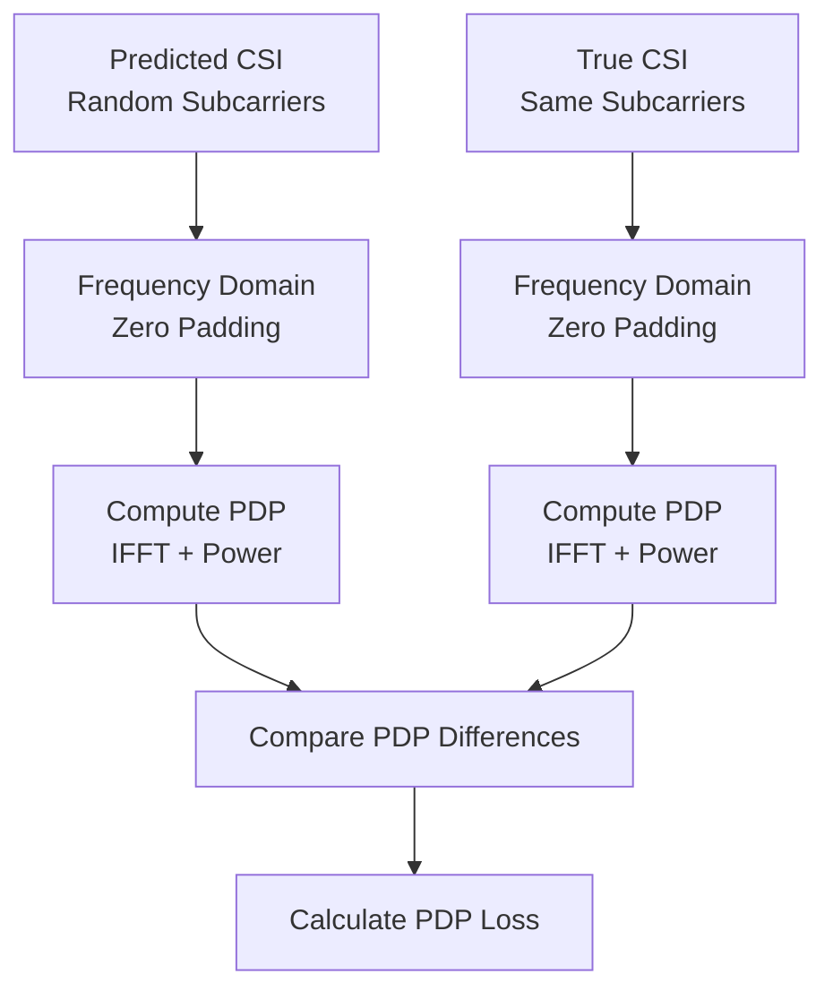

# Training Design Document

## Overview

This document outlines the training methodology and implementation for the Prism model, which extends NeRF2 architecture to handle wideband RF signals in Orthogonal Frequency-Division Multiplexing (OFDM) scenarios. The training system is designed to efficiently train neural networks that can model complex RF signal propagation through 3D environments with multiple subcarriers and MIMO antenna configurations.

## 1. Training Architecture

### 1.1 Model Components for Training

The Prism model consists of four main neural network components that are trained simultaneously:

#### 1.1.1 AttenuationNetwork
- **Purpose**: Encodes spatial position information into compact 128-dimensional feature representations
- **Architecture**: 8-layer MLP with ReLU activation
- **Input**: 3D position coordinates (x, y, z)
- **Output**: 128-dimensional feature vector

#### 1.1.2 AttenuationDecoder
- **Purpose**: Converts 128D spatial features into $N_\text{BS} \times N_\text{UE}$ attenuation factors
- **Architecture**: $N_\text{UE}$ independent 3-layer MLPs
- **Input**: 128D features from AttenuationNetwork
- **Output**: Attenuation factors for each BS-UE antenna combination

#### 1.1.3 RadianceNetwork
- **Purpose**: Processes UE position, viewing direction, and spatial features
- **Architecture**: 8-layer MLP with ReLU activation
- **Input**: UE position, viewing direction, and spatial features
- **Output**: Radiance values for signal propagation modeling

#### 1.1.4 AntennaNetwork
- **Purpose**: Process antenna embeddings to generate directional importance indicators for efficient ray tracing
- **Architecture**: Shallow network (64D → 128D → directional importance values)
- **Input**: 64-dimensional antenna embedding from antenna codebook
- **Output**: Directional importance matrix indicating importance of each direction
- **Key Features**: 
  - Enables efficient directional sampling for computational efficiency
  - Guides ray tracing to focus on antenna-specific important directions

## 2. Training Pipeline

### 2.1 Data Loading and Preprocessing

The training system handles complex multi-dimensional data including:

- **Spatial positions**: 3D coordinates for base stations, UEs, and sampling points
- **Subcarrier data**: Multiple subcarrier frequencies for OFDM signals
- **Antenna configurations**: MIMO setups with multiple UE and BS antennas
- **Ray tracing data**: AntennaNetwork-guided directional sampling and spatial point sampling

### 2.2 Training Loop Implementation

The training process follows this workflow:

1. **Data Loading**: Load training samples with proper tensor formatting
2. **Forward Pass**: Process data through all four network components
3. **BS-Centric Ray Tracing**: Start ray tracing from each BS antenna
4. **AntennaNetwork Direction Selection**: Use AntennaNetwork to suggest important directions for ray tracing
5. **Subcarrier Sampling**: Randomly select $K'<K$ subcarriers per antenna for computational efficiency
6. **CSI Prediction**: Calculate predicted CSI for selected subcarriers on each BS antenna
7. **Loss Computation**: Compute MSE between predicted CSI and ground truth CSI from real measurements
8. **Backward Pass**: Compute gradients and update model parameters
9. **Validation**: Periodic validation to monitor training progress

## 3. Loss Functions and Optimization

### 3.1 CSI Loss Functions

The choice of loss function is critical for training neural networks to predict complex-valued Channel State Information (CSI). This section presents several loss function approaches, from simple to sophisticated, for optimizing CSI prediction accuracy.

#### 3.1.1 Complex MSE

**The most commonly used and direct approach** that simultaneously optimizes both magnitude and phase components.

```math
\mathcal{L}_{\text{CMSE}} = \frac{1}{N} \sum_{i=1}^{N} \left\| \mathbf{H}_{\text{pred}}^{(i)} - \mathbf{H}_{\text{true}}^{(i)} \right\|_F^2 = \frac{1}{N} \sum_{i=1}^{N} \left( |\Delta \mathbf{H}_i| \right)^2
```

where $\Delta \mathbf{H}_i = \mathbf{H}_{\text{pred}}^{(i)} - \mathbf{H}_{\text{true}}^{(i)}$ is the complex error.

**Advantages:**
- Simple computation with clear physical meaning (Euclidean distance between complex vectors)
- Naturally handles both magnitude and phase optimization
- Stable gradients and well-behaved optimization

**Disadvantages:**
- Equal weighting for magnitude and phase errors may not be optimal for all applications

#### 3.1.2 Magnitude + Phase Loss

Separate handling of magnitude and phase components with adjustable weighting.

```math
\mathcal{L}_{\text{Mag+Phase}} = \alpha \cdot \frac{1}{N} \sum_{i=1}^{N} \left( |\mathbf{H}_{\text{pred}}^{(i)}| - |\mathbf{H}_{\text{true}}^{(i)}| \right)^2 + \beta \cdot \frac{1}{N} \sum_{i=1}^{N} \mathcal{L}_{\text{Phase}}^{(i)}
```

The **phase loss $\mathcal{L}_{\text{Phase}}$ is critical** and can be defined in two ways:

**Option 1: Corrected Phase Difference MSE** (handles $2\pi$ wrapping):
```math
\mathcal{L}_{\text{Phase}}^{(i)} = \left( \arctan2\left( \sin(\Delta\theta_i), \cos(\Delta\theta_i) \right) \right)^2
```
where $\Delta\theta_i = \angle \mathbf{H}_{\text{pred}}^{(i)} - \angle \mathbf{H}_{\text{true}}^{(i)}$.

**Option 2: Complex Cosine Similarity** (more stable):
```math
\mathcal{L}_{\text{Phase}}^{(i)} = 1 - \frac{ | \langle \mathbf{H}_{\text{pred}}^{(i)}, \mathbf{H}_{\text{true}}^{(i)} \rangle | }{ |\mathbf{H}_{\text{pred}}^{(i)}| \cdot |\mathbf{H}_{\text{true}}^{(i)}| } = 1 - |\cos(\Delta\theta_i)|
```

**Advantages:**
- Flexible weighting between magnitude and phase importance
- Suitable for applications where phase accuracy is critical (e.g., beamforming)

**Disadvantages:**
- Requires manual tuning of hyperparameters $\alpha$ and $\beta$

#### 3.1.3 Correlation-Based Loss

Focuses on structural similarity between CSI vectors rather than absolute errors.

```math
\mathcal{L}_{\text{Corr}} = 1 - \frac{ | \langle \mathbf{H}_{\text{pred}}, \mathbf{H}_{\text{true}} \rangle | }{ \|\mathbf{H}_{\text{pred}}\|_F \cdot \|\mathbf{H}_{\text{true}}\|_F } = 1 - \frac{ | \sum_{i=1}^{N} \mathbf{H}_{\text{pred}}^{(i)} \cdot (\mathbf{H}_{\text{true}}^{(i)})^* | }{ \sqrt{ \sum |\mathbf{H}_{\text{pred}}^{(i)}|^2 } \cdot \sqrt{ \sum |\mathbf{H}_{\text{true}}^{(i)}|^2 } }
```

**Advantages:**
- Invariant to global magnitude scaling (same loss for $H_{\text{pred}}$ and $k \cdot H_{\text{pred}}$)
- Emphasizes **structural similarity**, directly related to communication performance metrics
- Robust to amplitude variations while preserving phase relationships

**Disadvantages:**
- May need combination with other losses if absolute magnitude values are important

#### 3.1.4 Hybrid CSI Loss Function (Recommended)

For optimal performance, we recommend combining the strengths of multiple approaches:

```math
\mathcal{L}_{\text{Total}} = \lambda_1 \cdot \mathcal{L}_{\text{CMSE}} + \lambda_2 \cdot \mathcal{L}_{\text{Corr}}
```

**Rationale:**
- $\mathcal{L}_{\text{CMSE}}$ ensures **absolute value accuracy**
- $\mathcal{L}_{\text{Corr}}$ ensures **structural similarity**, critical for application performance
- The combination provides both stability and effectiveness
- Typically $\lambda_1 = \lambda_2 = 1$ works well in practice

#### 3.1.5 CSI Loss Function Analysis

The following diagram provides a comprehensive analysis of CSI loss function computation methods and their mathematical properties:

```mermaid
flowchart TD
    A["CSI Loss Function Analysis"] --> B["1. Input Processing"]
    A --> C["2. Loss Computation Methods"]
    A --> D["3. Mathematical Properties"]
    
    B --> B1["Predicted CSI<br/>(Complex-valued H_pred)"]
    B --> B2["Target CSI<br/>(Complex-valued H_true)"]
    B1 --> B3["Real: a + jb"]
    B2 --> B4["Real: c + jd"]
    B3 --> B5["Magnitude: |H_pred| = √(a²+b²)<br/>Phase: ∠H_pred = arctan(b/a)"]
    B4 --> B6["Magnitude: |H_true| = √(c²+d²)<br/>Phase: ∠H_true = arctan(d/c)"]
    
    C --> C1["Complex MSE<br/>L = |H_pred - H_true|²<br/>= (a-c)² + (b-d)²"]
    C --> C2["Magnitude Loss<br/>L_mag = ||H_pred| - |H_true||²"]
    C --> C3["Phase Loss<br/>L_phase = |∠H_pred - ∠H_true|²<br/>with 2π wrapping handling"]
    C --> C4["Correlation Loss<br/>L_corr = 1 - |⟨H_pred, H_true⟩|<br/>/ (||H_pred|| × ||H_true||)"]
    C --> C5["Hybrid Combination<br/>L = λ₁×CMSE + λ₂×Corr"]
    
    D --> D1["Optimization Paths<br/>Different gradient flows"]
    D --> D2["Physical Meaning<br/>Euclidean vs Polar coordinates"]
    D --> D3["Weighting Control<br/>Adjustable importance factors"]
    D --> D4["Stability Properties<br/>Gradient behavior analysis"]
    
    E["Implementation Features"] --> E1["✓ Gradient-friendly computation"]
    E --> E2["✓ Batch processing support"]
    E --> E3["✓ Complex tensor operations"]
    E --> E4["✓ Numerical stability handling"]
    
    F["Applications"] --> F1["MIMO channel estimation"]
    F --> F2["Beamforming optimization"]
    F --> F3["Signal reconstruction"]
    F --> F4["Communication performance"]
    
    style A fill:#e1f5fe
    style C5 fill:#e8f5e8
    style E fill:#f3e5f5
    style F fill:#fff3e0
```



**Key Features:**
- **Comprehensive Processing**: Detailed breakdown from complex input to loss computation
- **Multiple Methods**: Complete coverage of all implemented loss function types
- **Mathematical Rigor**: Explicit formulations showing the relationship between Cartesian and polar representations
- **Implementation Ready**: Practical considerations for gradient computation and numerical stability
- **Application Focused**: Direct relevance to RF communication and channel modeling tasks

### 3.2 PDP Loss Functions

Power Delay Profile (PDP) loss functions provide a time-domain perspective for validating CSI predictions by comparing the delay-domain characteristics of predicted and true CSI. This approach is particularly valuable for ensuring that the predicted CSI maintains correct temporal structure, which is crucial for applications like positioning and beamforming.

#### 3.2.1 Core Computation Flow

The PDP loss computation follows this workflow for comparing **predicted CSI** and **true CSI** (both on randomly selected subcarriers):

1. **Zero Padding**: Pad both predicted and true CSI to the same complete frequency sequence (e.g., 1024 points)
2. **PDP Calculation**: Apply IFFT to zero-padded frequency data and compute power delay profile
   - $\text{PDP}_{\text{pred}} = |\text{IFFT}(\text{CSI}_{\text{pred,padded}})|^2$
   - $\text{PDP}_{\text{true}} = |\text{IFFT}(\text{CSI}_{\text{true,padded}})|^2$
3. **PDP Comparison**: Calculate differences between the two PDPs as loss function or evaluation metric



#### 3.2.2 Mean Squared Error (MSE) PDP Loss

The most direct approach, computing MSE between PDPs at each delay bin:
```math
\mathcal{L}_{\text{PDP,MSE}} = \frac{1}{M} \sum_{m=1}^{M} \left( \text{PDP}_{\text{pred,norm}}[m] - \text{PDP}_{\text{true,norm}}[m] \right)^2
```

**Advantages:**
- Simple computation and implementation
- Direct comparison of delay-domain characteristics
- Well-suited for applications requiring precise delay profile matching

**Disadvantages:**
- Sensitive to normalization choices
- May be affected by zero-padding artifacts

#### 3.2.3 Correlation-Based PDP Loss

Focuses on shape similarity rather than absolute values:
```math
\rho = \text{corrcoef}(\text{PDP}_{\text{pred}}, \text{PDP}_{\text{true}})
```
```math
\mathcal{L}_{\text{PDP,corr}} = 1 - \rho
```
where ideally $\rho = 1$ and $\mathcal{L}_{\text{PDP,corr}} = 0$.

**Advantages:**
- Robust to absolute power scaling differences
- Emphasizes structural similarity in delay domain
- Less sensitive to normalization artifacts

**Disadvantages:**
- May ignore important absolute timing information
- Requires careful handling of noise and artifacts

#### 3.2.4 Dominant Path Feature Loss

Extracts and compares key characteristics:
- **Dominant path delay error**: $\mathcal{L}_{\text{delay}} = |\arg\max(\text{PDP}_{\text{pred}}) - \arg\max(\text{PDP}_{\text{true}})|$
- **RMS delay spread error**: $\mathcal{L}_{\text{spread}} = |\sigma_{\text{pred}} - \sigma_{\text{true}}|$
- **Dominant path power ratio error**: $\mathcal{L}_{\text{power}} = \left|\frac{\max(\text{PDP}_{\text{pred}})}{\sum \text{PDP}_{\text{pred}}} - \frac{\max(\text{PDP}_{\text{true}})}{\sum \text{PDP}_{\text{true}}}\right|$

**Advantages:**
- Focuses on physically meaningful parameters
- Directly relates to communication performance metrics
- Robust to detailed shape variations

**Disadvantages:**
- May miss important multipath structure details
- Requires domain expertise for parameter selection

#### 3.2.5 Hybrid PDP Loss Function (Recommended)

For optimal performance, we recommend combining multiple PDP loss approaches:

```math
\mathcal{L}_{\text{PDP,total}} = \alpha \cdot \mathcal{L}_{\text{PDP,MSE}} + \beta \cdot \mathcal{L}_{\text{PDP,corr}} + \gamma \cdot \mathcal{L}_{\text{delay}}
```

**Rationale:**
- $\mathcal{L}_{\text{PDP,MSE}}$ ensures **detailed delay profile accuracy**
- $\mathcal{L}_{\text{PDP,corr}}$ ensures **structural similarity** in time domain
- $\mathcal{L}_{\text{delay}}$ ensures **dominant path timing accuracy**
- The combination provides comprehensive time-domain validation
- Typically $\alpha = 0.5$, $\beta = 0.3$, $\gamma = 0.2$ works well in practice

**Advantages:**
- Comprehensive time-domain validation
- Balances detailed accuracy with structural correctness
- Robust to various types of prediction errors

**Disadvantages:**
- Requires tuning of multiple hyperparameters
- Higher computational cost than individual methods

#### 3.2.6 PDP Loss Function Analysis

The following diagram illustrates the comprehensive PDP loss computation flow and implementation considerations:

```mermaid
flowchart TD
    A["PDP Loss Function Analysis"] --> B["1. Core Computation Flow"]
    A --> C["2. Loss Function Types"]
    A --> D["3. Implementation Considerations"]
    
    B --> B1["Predicted CSI<br/>(Random Subcarriers)"]
    B --> B2["True CSI<br/>(Same Subcarriers)"]
    B1 --> B3["Zero Padding to FFT Size"]
    B2 --> B4["Zero Padding to FFT Size"]
    B3 --> B5["IFFT + Power<br/>PDP_pred = |IFFT(CSI_pred)|²"]
    B4 --> B6["IFFT + Power<br/>PDP_true = |IFFT(CSI_true)|²"]
    B5 --> B7["PDP Comparison & Loss"]
    B6 --> B7
    
    C --> C1["MSE PDP Loss<br/>L = Σ(PDP_pred - PDP_true)²"]
    C --> C2["Correlation PDP Loss<br/>L = 1 - corrcoef(PDP_pred, PDP_true)"]
    C --> C3["Delay Feature Loss<br/>L = |argmax(PDP_pred) - argmax(PDP_true)|"]
    C --> C4["Hybrid PDP Loss<br/>L = α×MSE + β×Corr + γ×Delay"]
    
    D --> D1["Normalization<br/>Peak or Energy normalization"]
    D --> D2["Subcarrier Alignment<br/>Identical indices & zero-padding"]
    D --> D3["Artifact Handling<br/>Consistent sidelobe patterns"]
    D --> D4["Physical Significance<br/>Time-domain validation"]
    
    E["Advantages"] --> E1["✓ Time-domain validation"]
    E --> E2["✓ Physical meaningfulness"]
    E --> E3["✓ Multipath structure preservation"]
    E --> E4["✓ Robust to individual subcarrier errors"]
    
    F["Applications"] --> F1["Positioning systems"]
    F --> F2["Beamforming optimization"]
    F --> F3["Channel modeling validation"]
    F --> F4["Temporal structure analysis"]
    
    style A fill:#e1f5fe
    style C4 fill:#e8f5e8
    style E fill:#f3e5f5
    style F fill:#fff3e0
```



**Key Features:**
- **Dual-domain validation**: Ensures both frequency-domain accuracy and time-domain physical correctness
- **Multipath preservation**: Critical for applications requiring accurate delay-domain characteristics
- **Robust evaluation**: Less sensitive to individual subcarrier prediction errors
- **Application-specific**: Directly relevant for positioning, beamforming, and channel modeling

**Implementation Considerations:**

**Normalization Requirements:**
Before comparison, PDPs must be **normalized** to the same total energy or peak energy to focus on shape rather than absolute power:
- Peak normalization: $\text{PDP}_{\text{norm}} = \text{PDP} / \max(\text{PDP})$
- Energy normalization: $\text{PDP}_{\text{norm}} = \text{PDP} / \sum(\text{PDP})$

**Subcarrier Alignment:**
Ensure that predicted and true CSI come from **identical subcarrier indices** with identical zero-padding patterns.

**Handling Artifacts:**
Zero-padding introduces sidelobe effects in both predicted and true PDPs. The loss remains valid as long as:
- Both PDPs exhibit consistent artifact patterns
- Relative positions and strengths of true multipath peaks are preserved

**Physical Significance:**
PDP loss functions offer several advantages over frequency-domain comparisons:
- **Time-domain validation**: Ensures predicted CSI maintains correct **delay-domain structure**
- **Physical meaningfulness**: Directly relates to multipath propagation characteristics
- **Application relevance**: Critical for positioning, beamforming, and channel modeling applications
- **Robustness**: Less sensitive to individual subcarrier errors while emphasizing overall temporal structure

**Recommendation:** Use PDP loss as a complementary validation metric alongside frequency-domain CSI losses. This dual-domain approach ensures both numerical accuracy and physical correctness of the predicted channel characteristics.

### 3.3 Loss Function Selection Guide

| Application Focus | Recommended Loss Function |
|:-----------------|:-------------------------|
| **General Purpose** | **Complex MSE** ($\mathcal{L}_{\text{CMSE}}$) |
| **Phase Accuracy Critical** | **Magnitude + Phase Loss** ($\mathcal{L}_{\text{Mag+Phase}}$) |
| **Beamforming/Correlation** | **Correlation Loss** ($\mathcal{L}_{\text{Corr}}$) |
| **Best Performance** | **Hybrid CSI Loss** ($\mathcal{L}_{\text{CMSE}} + \mathcal{L}_{\text{Corr}}$) |
| **Time-domain Validation** | **PDP Loss** ($\mathcal{L}_{\text{PDP}}$) |
| **Comprehensive Validation** | **Hybrid PDP Loss** ($\mathcal{L}_{\text{PDP,total}}$) |
| **Production Use** | **Hybrid CSI+PDP Loss** ($\mathcal{L}_{\text{total}}$) |


